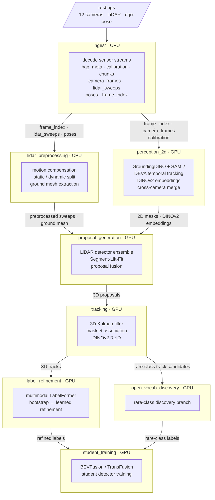

# wato_world

Dockerized 3D auto-labeling pipeline for the WATonomous self driving car (dubbed EVE). Encompasses an offline batch system that turns rosbags (12 cameras + LiDAR + ego-pose) into 3D box tracks with class labels.

## Architecture

Eight components communicate only through artifacts on disk (`data/artifacts/`). No in-process imports across component boundaries.



`frame_index.parquet` (written by **ingest**) is the cross-component contract: every downstream stage reads `world_T_ego_flat` (interpolated ego pose per LiDAR sweep) from it rather than consuming raw bag topics.

Only **ingest** is implemented end-to-end. All other components are stubs.

## Layout

```
wato_world/
├── watod                    # entrypoint (mirrors wato_monorepo/watod)
├── watod-config.sh          # user-editable defaults
├── watod_scripts/           # helpers invoked by watod
├── src/                         # one Python package per pipeline component
│   ├── common/                  # shared lib: storage, schemas, geometry, calib
│   ├── ingest/
│   ├── perception_2d/
│   ├── lidar_preprocessing/
│   ├── proposal_generation/
│   ├── tracking/
│   ├── label_refinement/
│   ├── open_vocab_discovery/
│   └── student_training/
├── docker/                      # one Dockerfile per component + base + template
├── modules/                     # docker-compose.{yaml,infra,dev,gpu}.yaml
├── config/                      # prompts.yaml, pipeline.yaml, component_versions.yaml
├── data/                        # bind-mounted into containers (git-ignored)
└── notebooks/                   # ad-hoc analysis (rerun viewer scripts, etc.)
```

## Quickstart

```bash
# 1. Choose active modules. Prefer a local override so committed defaults stay clean.
test -f watod-config.local.sh || cp watod-config.sh watod-config.local.sh
$EDITOR watod-config.local.sh
# Example setting for ingest development:
# export ACTIVE_MODULES="ingest:dev"

# 2. Symlink watod into your PATH (one-time).
./watod install

# 3. Build the active component images.
watod build

# 4. Bring up the active components.
watod up

# 5. Run a component on a bag under data/bags/. Example: 
watod run ingest /data/bags/my_bag

# 6. Open a dev shell in an active dev container with source bind-mounted.
# First set ACTIVE_MODULES="perception_2d:dev" in watod-config.local.sh, then:
watod build
watod up
watod -t perception_2d_dev
> pytest /ws/src/perception_2d/tests

# 7. Tear everything down.
watod down all
```

## Components

| Component | Purpose | Image base | GPU |
|---|---|---|---|
| `ingest` | Decode rosbag → frames + lidar + poses + frame_index | CPU | no |
| `perception_2d` | GroundingDINO + SAM 2 + DEVA + DINOv2 + x-cam merge | CUDA | yes |
| `lidar_preprocessing` | Motion comp, static/dynamic split, ground mesh | CPU | no |
| `proposal_generation` | LiDAR detector + Segment-Lift-Fit + fusion | CUDA | yes |
| `tracking` | 3D Kalman + masklet association + DINOv2 ReID | CUDA | yes (light) |
| `label_refinement` | Multimodal LabelFormer (bootstrap → learned) | CUDA | yes |
| `open_vocab_discovery` | Rare-class discovery branch | CUDA | yes |
| `student_training` | BEVFusion / TransFusion student training | CUDA | yes |

Each component's Python package lives at `src/<component>/src/wato_<component>/`
and is pip-installed editable inside the container. Components communicate
**only through artifacts** in `data/artifacts/` (or `s3://wato-world/...` in
prod) — no in-process imports across component boundaries.

## Storage

- **Artifact store**: `data/artifacts/` bind-mounted at `/data/artifacts`.
  All paths flow through `wato_common.storage`, which uses fsspec so the
  same code works against `s3://...` URIs in prod.
- **Metadata index**: artifact files themselves. Components write Parquet indexes,
  JSON manifests, and quality reports under `data/artifacts/`; no database
  service is required for the current pipeline.
- **Versioning**: each component's output is namespaced by version
  (`perception_2d/v1/...`). Bump the version in `config/component_versions.yaml`
  whenever the model checkpoint or output schema changes.

## Configuration

- `watod-config.sh` — committed defaults (active components, GPU flag, registry).
- `watod-config.local.sh` — optional, git-ignored, sourced after the main
  config. Use it to override per-host values.
- `modules/.env` — auto-generated by `watod_scripts/watod-setup-env.sh`
  on every `watod` invocation. Never edit by hand.

## Development

```bash
# Lint/format locally.
pip install pre-commit && pre-commit install
pre-commit run --all-files

# Run a component's tests inside its dev container.
watod test ingest
```

## Build order (recommended)

1. Skeleton + infra (this repo as-is): set `ACTIVE_MODULES="all"` in `watod-config.local.sh`, then run `watod build`.
2. Ingest end-to-end on one bag.
3. Host-side rerun viewer (notebooks/).
4. LiDAR preprocessing (CPU).
5. 2D perception (heavy GPU pass).
6. Proposal generation, LiDAR-only first; add SLF lift second.
7. Tracking.
8. Bootstrap label refinement (geometric only) → first auto-labels.
9. Learned label refinement, open-vocabulary discovery, student training.
